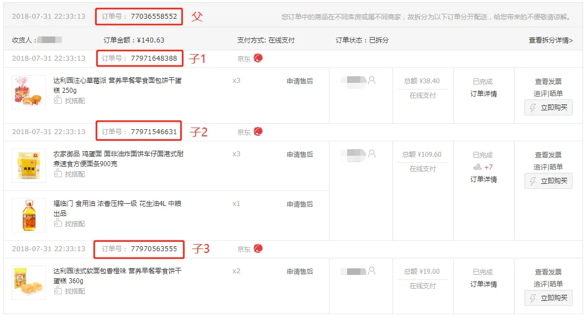
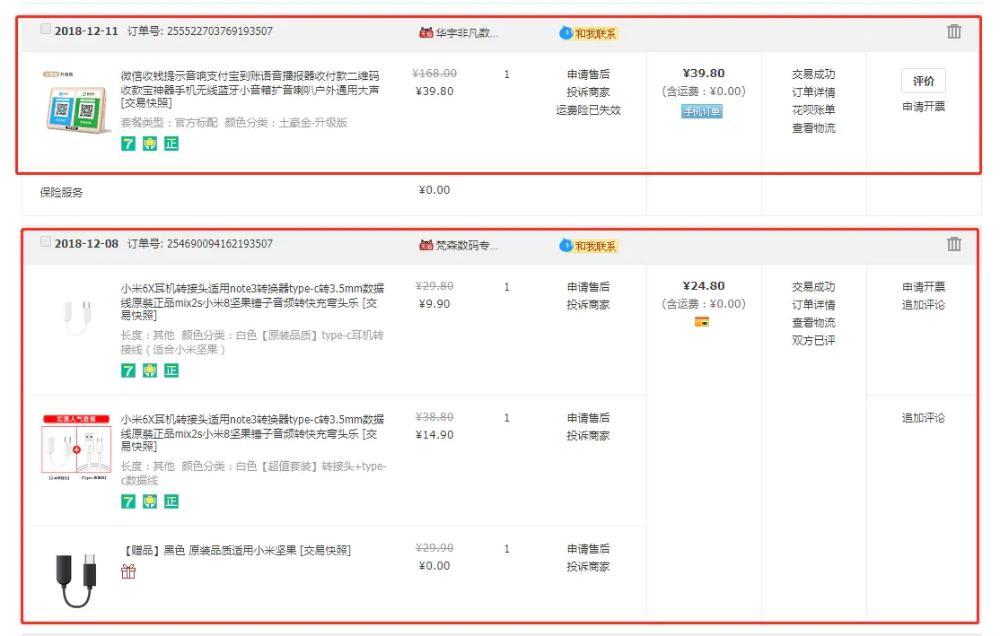

# 电商产品设计——订单拆分模式

今天简单讲讲目前常见的三种订单拆分模式。

##### 一、父子模式（京东模式）

这种订单拆分模式的代表产品是京东，请看下图：

 

京东订单

一开始下单的时候，订单是以一个父订单的形式存在的，当你完成付款后，订单就被拆成了多个子订单。

如果你仔细观察的话，相信你会发现图中子订单1和子订单3都是只对应一个商品的，而子订单2是对应了2个商品的。为什么呢？这里面有什么规律吗？

当然有。由于京东是自营和第三方商家同时存在的，而自营商品会根据你不同的下单地点分配到不同的配货仓库，所以你下单的时候，会生成一个父订单，包含了你结算时候的所有商品，然后系统会根据不同的配货仓库和第三方商家拆分成不同的子订单，最终就是一个配货仓库（或一个第三方商家）对应一个子订单，相同的配货仓库（或第三方商家）下的商品会合并在一个子订单中。如果要取消订单，只能针对子订单进行取消，不能针对单个商品进行取消。

##### 二、半拆模式（淘宝模式）

这种订单拆分模式的代表产品是淘宝，请看下图：

 

淘宝订单

淘宝是在下单的时候就已经把订单按照不同的商家进行拆分了，所以不像京东那样会有父订单和子订单，同一个商家下的商品还是会合并在一个订单中

##### 三、全拆模式（一对一模式）

上面说的两种模式，他们的拆分规律其实并不难理解，因为是实物交易，所以物流配送都是以商家（仓储）为单位的，保证一个商家接收到来自同一个用户的唯一订单，即方便了商家拣货，又减轻了系统对于订单推送处理的压力。

但是当你的网站交易的不是实物商品的时候，比如游戏虚拟物品交易，不用牵扯到物流这个环节，就没有必要以商家作为单位来进行订单拆分了，这个时候就有了第三种拆分模式：全拆模式，又可以叫“一对一模式”，顾名思义，就是一个商品对应一个订单，不用合并，在用户下单的时候就把订单按照这样的形式全拆开来。这种模式比较少见，只有在具有特定业务的网站中才会出现，这里就不展开讨论了。

其实订单的拆分关系到优惠券、满减等优惠活动的金额分配，这又是一个逻辑稍显复杂的模块，以后会单独拿出来分享。

原文：https://www.jianshu.com/p/5b7c5479a650

 

 

 

 

 